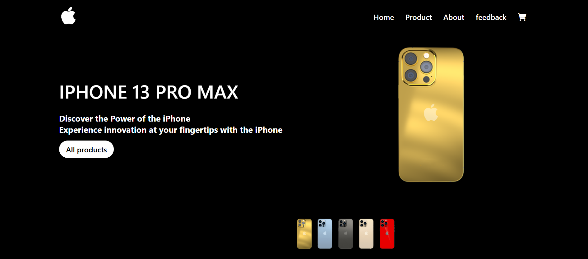
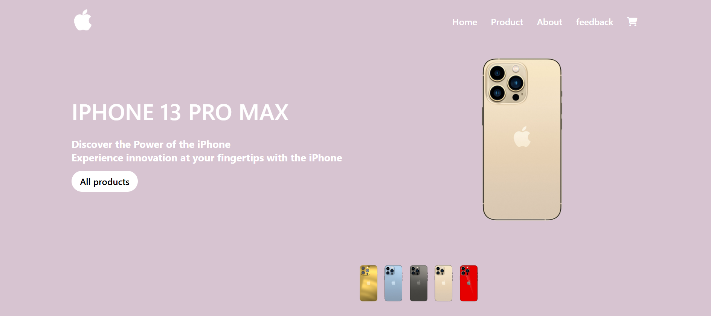
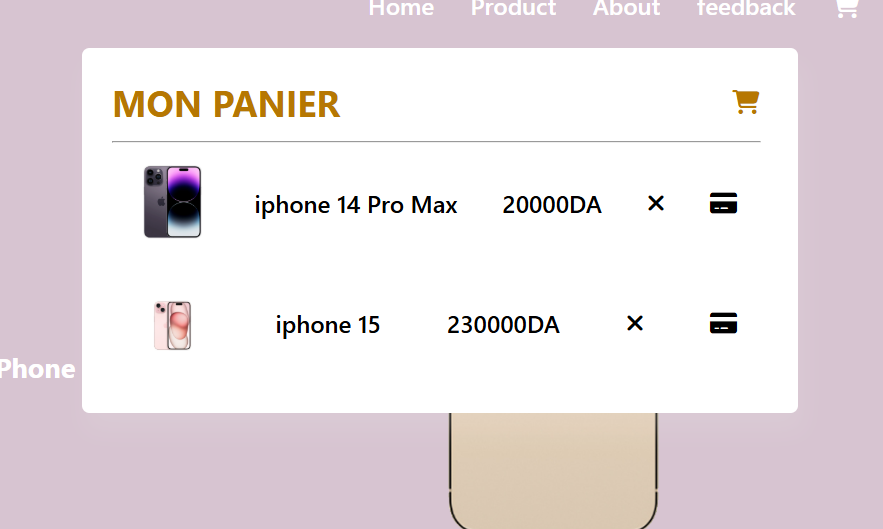
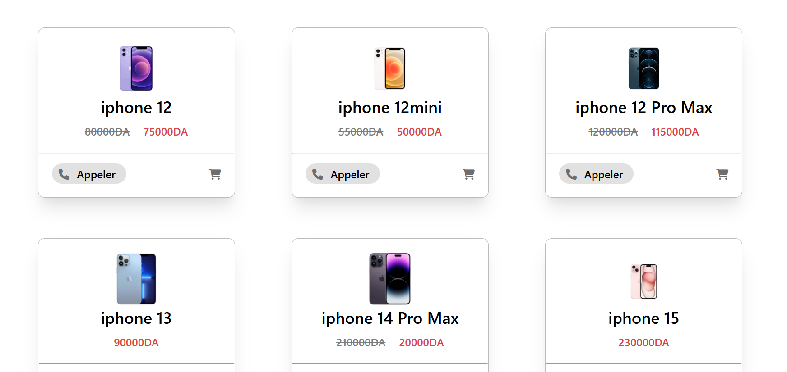
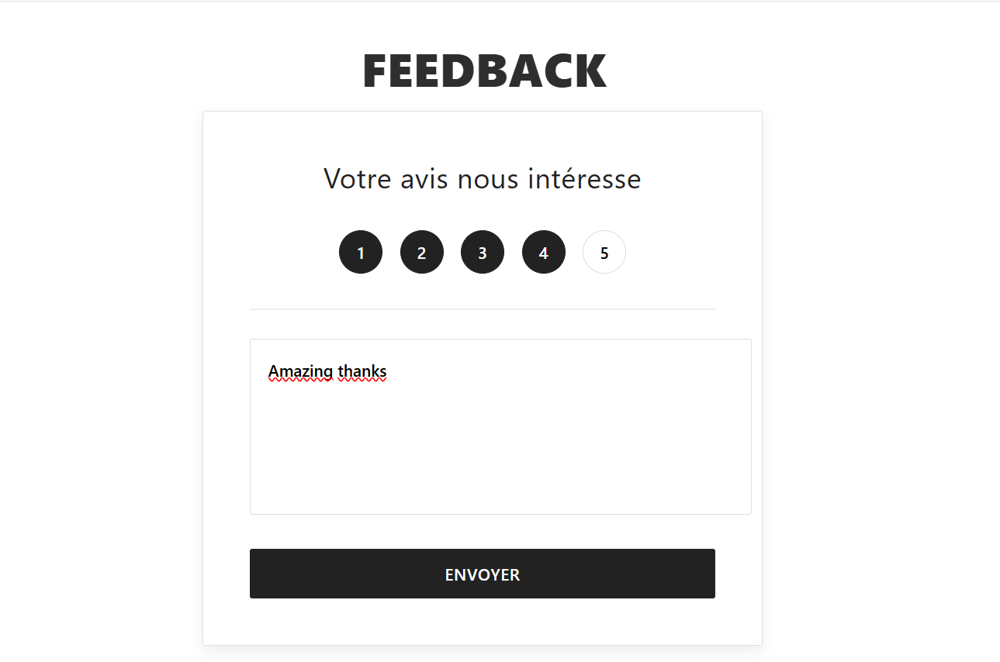

# Mini Frontend E-Commerce for iPhones

## Overview

This is a **mini frontend e-commerce app** built to enforce my skills in **JavaScript**, **DOM manipulation**, and **CSS styling**.  
It simulates core online store interactions but is purely frontend ( no backend or real transactions involved ) 

The focus was on:

- Mastering the **DOM API** for dynamic page updates.
- Structuring an HTML page into logical sections.
- Styling with **CSS** for a clean and responsive layout.
- Managing app state with **localStorage** to persist data.

---

## Features

- **Color selection**: Switch between different iPhone colors, updating the product image and background dynamically.

   

   
  
- **Shopping cart**:  
  - Add/remove items.
  - Cart state saved in `localStorage` to persist after reload.  
  - Product icons reflect cart status.
    
     
     
    
- **Product details persistence**: Store product name, image, and price in `localStorage`.
    
- **Order simulation**:  
  - Submit email/phone to simulate purchase.  
  - Purchased items removed from cart.  
  - Local order history saved.  
- **Contact panel toggle**: Show/hide contact icons for Viber, WhatsApp, and phone.  
- **Rating system**: Save and restore product ratings.

  
   

  
- **Feedback form**: Simple validation before submission.  
- **Dynamic UI interactions**: Panels toggle, click outside to close, thank-you messages after actions.

---

## Technologies Used

- HTML5  
- CSS3  
- JavaScript (ES6): event listeners, DOM traversal, dynamic element creation, `localStorage` management

---

## Purpose

This is a learning project, not production-ready. It helped me:

- Break down UI into functional components.  
- Deepen understanding of DOM events and element manipulation.  
- Build clean, maintainable JavaScript for real UI features

---

## How to Run

1. Clone or download the repo.  
2. Open `index.html` in any modern browser.  
3. Explore: change colors, manage cart, submit ratings, simulate orders.

---
** ps : Any suggestions for this mini project are welcome—don’t hesitate to share! :) **

---
